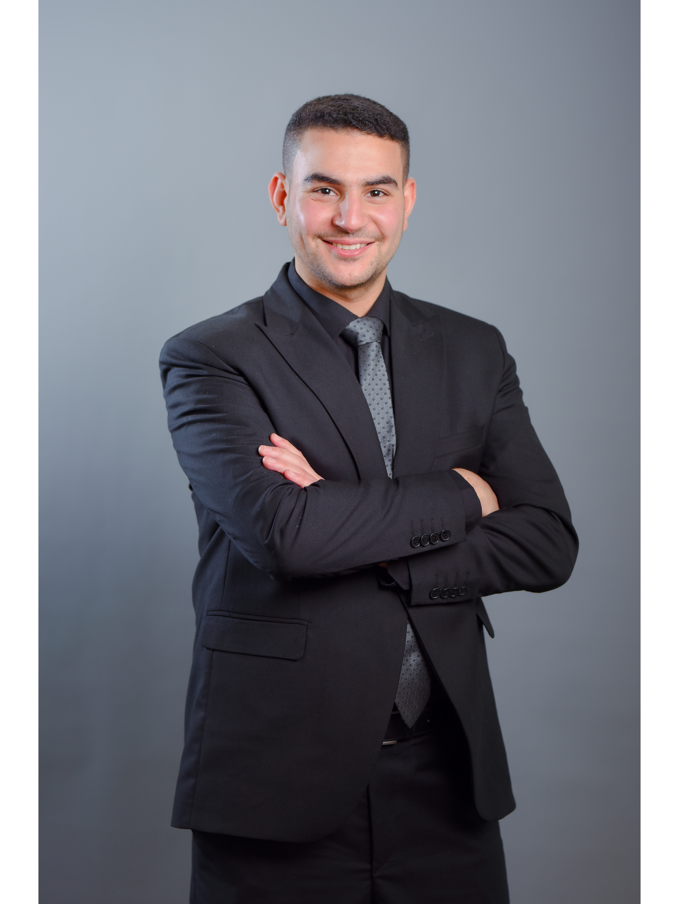

# Omar Ahmed Sanad — Portfolio

A personal portfolio website built with plain HTML, CSS, and JavaScript (no build step required).

## Structure

```
index.html          Main page (all sections)
css/style.css        Styles
js/main.js           Nav, scroll-reveal, active-link behavior
assets/resume/        Resume PDF (linked from the "Resume" button)
assets/img/           Profile photo (add yours here)
```

## Running locally

Just open `index.html` in a browser, or serve it locally:

```bash
python3 -m http.server 8000
```

Then visit `http://localhost:8000`.

## Adding your profile photo

Drop a photo at `assets/img/profile.jpg`, then in `index.html` replace the
`.avatar` div (inside `.avatar-ring`) with:

```html

```

and add a matching `.avatar-photo { width:100%; height:100%; border-radius:50%; object-fit:cover; }`
rule to `css/style.css`.

## Deploying

This is a static site — it can be deployed as-is to GitHub Pages, Netlify, Vercel, or any static host.
